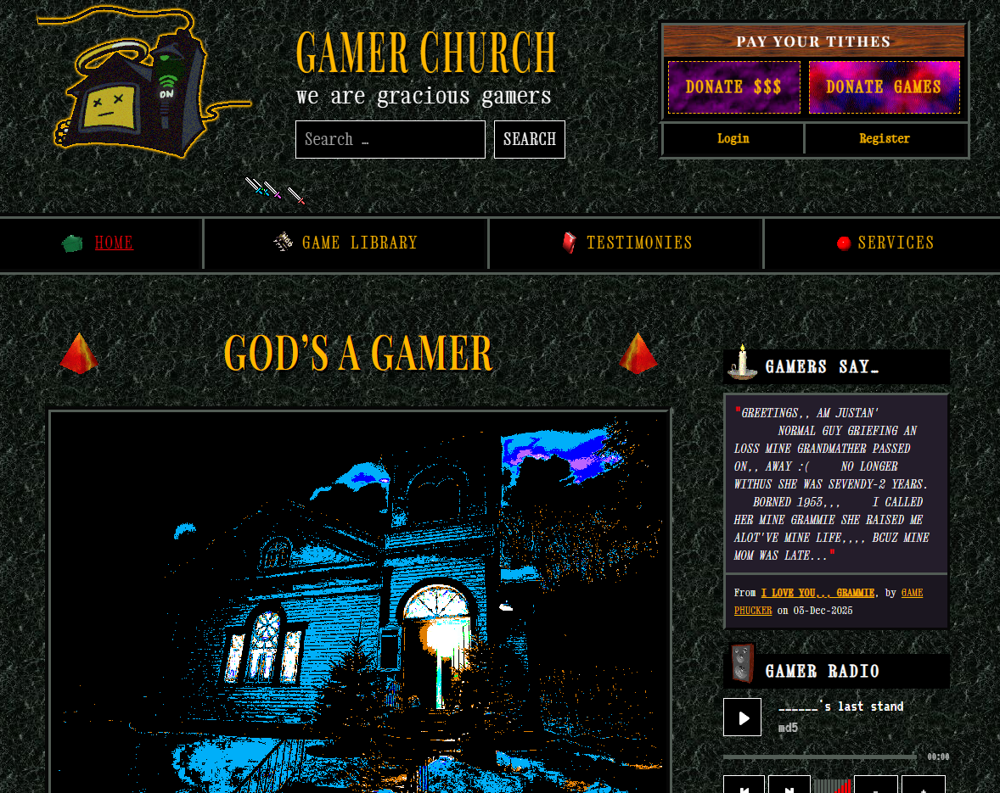
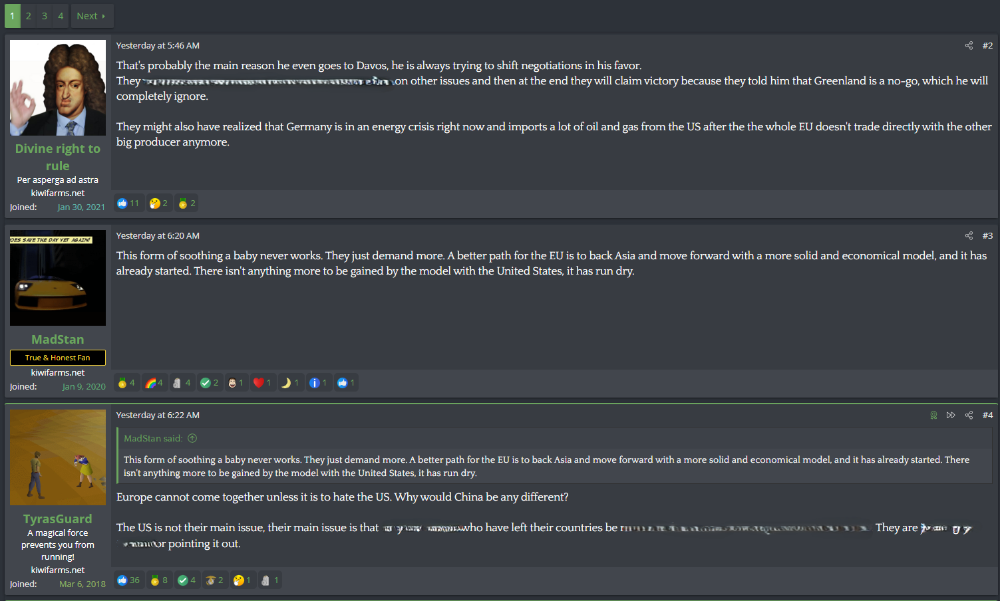

# JakkerParadise
>A home for soyjaks one and all!!!


## Authors: 

**Garett Clark** and **Ryan Lovvorn** https://github.com/RyanLvv/
## Attribution: 
Visual Studio Code, Dr.Barry Cumbie, GitHub, Co-Pilot


## Aim: 

Currently working on a forum that will contain multiple boards that will be about soyjak culture and satirical culture in general.

## Background: 

I have been a big fan of old forum websites. They feel to me to be more personal than anyother social media app. I prefer this website to be primarily desktop-based, but the truth is, most people access the internet through their phones. I grew up
browsing various forums during my childhood and found them to be intriguing. Something I always enjoyed was the culture and language
that spawned from this website. I never asked what these phrases meant until I lurked more. I hope that newer generations can share
in this enjoyment. I am so glad my professor, Dr.Barry Cumbie, has allowed me the possibility of making something that was a defining
moment of my childhood.


## References: 

https://github.com/SelmiAbderrahim/Free-Forum-Template, https://www.w3schools.com/, https://github.com/barrycumbie/bearbot


## Inspiration




I love Gamer Church for its widespread use of gifs, I wish to do the same and possibily make some gifs of my own.





I wanted to make a site similar to KiwiFarms.com system, with users having the ability to make their own profiles and profile pictures while remaining annoymous.


## Code Examples

This is the life blood of the website, without the navbar, this website is doomed! It assists in the navigation between pages.

from `pages/index.html` 

```html 
<nav class="navbar navbar-expand-lg navbar-light bg-light">
  <div class="container-fluid">
    <a class="navbar-brand brand" href="../index.html">JakkerParadise</a>
    <button class="navbar-toggler" type="button" data-bs-toggle="collapse" data-bs-target="#mainNav"
      aria-controls="mainNav" aria-expanded="false" aria-label="Toggle navigation">
      <span class="navbar-toggler-icon"></span>
    </button>
    <div class="collapse navbar-collapse" id="mainNav">
      <ul class="navbar-nav me-auto mb-2 mb-lg-0 nav-list">
        <li class="nav-item"><a class="nav-link" href="../index.html">Home</a></li>
        <li class="nav-item"><a class="nav-link" href="thread.html">Forums</a></li>
        <li class="nav-item"><a class="nav-link" href="signup.html">Sign Up</a></li>
        <li class="nav-item"><a class="nav-link" href="discription.html">Detail</a></li>
        <li class="nav-item"><a class="nav-link" href="search.html">Find Wojaks</a></li>
      </ul>
    </div>
  </div>
</nav>
```

from `scripts/profile-creator.js` I got this from w3schools, but it allows you to edit your profile and display it.

```js
function initProfileCreator() {
  const picInput = document.getElementById('profilePicInput');
  const picPreview = document.getElementById('profilePicPreview');
  const usernameInput = document.getElementById('profileUsername');
  const descInput = document.getElementById('profileDescription');
  const twitterInput = document.getElementById('socialTwitter');
  const instaInput = document.getElementById('socialInstagram');
  const saveBtn = document.getElementById('saveProfile');

  const stored = sessionStorage.getItem('profile');
  let profile = stored ? JSON.parse(stored) : {};
  if (!profile.username) {
    profile.username = sessionStorage.getItem('username') || '';
  }
  if (profile.username) {
    usernameInput.value = profile.username;
  }
  if (profile.desc) {
    descInput.value = profile.desc;
  }
  if (profile.pic) {
    picPreview.src = profile.pic;
  }
  if (profile.social) {
    twitterInput.value = profile.social.twitter || '';
    instaInput.value = profile.social.instagram || '';
  }
  ```
